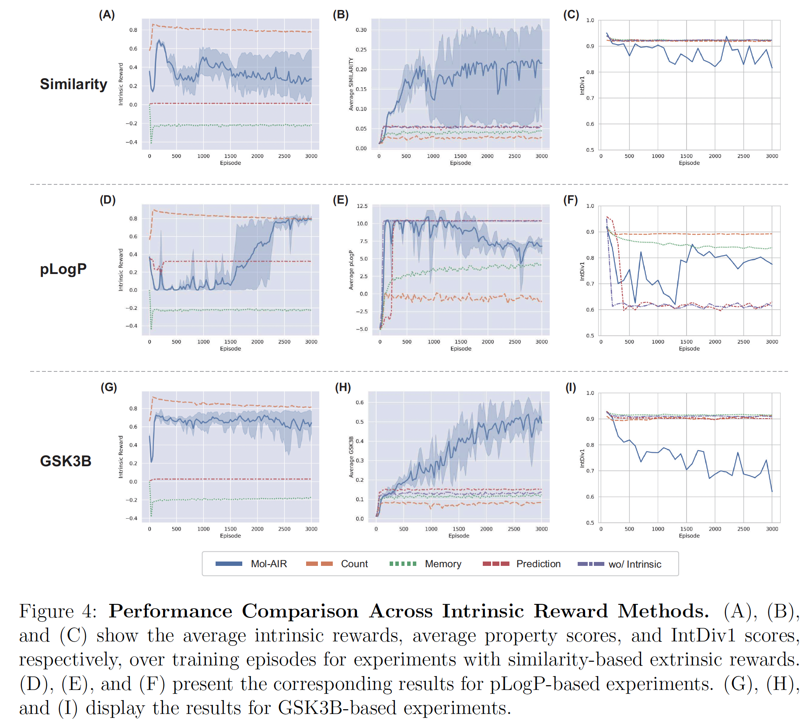
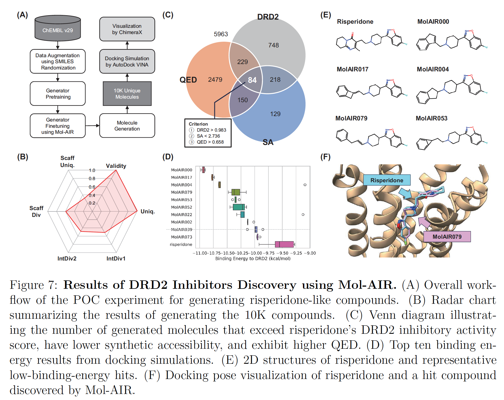

# Mol-AIR

**Mol-AIR** is a reinforcement learning-based
framework using adaptive intrinsic rewards for effective goal-directed molecular generation. Mol-AIR leverages the strengths of **both history-based and learning-based intrinsic rewards** by exploiting random distillation network and counting-based strategies. You can find the details of Mol-AIR in the paper: 

[Mol-AIR: Molecular Reinforcement Learning with Adaptive Intrinsic Reward for Goal-directed Molecular Generation](https://arxiv.org/abs/2403.20109)

This repository provides the implementation of Mol-AIR and the experiments on the molecular generation tasks.

| [Overview](#overview) | [Setup & Run Experiments](#setup--run-experiments) | [Experiment Results](#experiment-results) | [Configuration](#configuration) | [Citation](#citation) |

## Overview

We have two types of experiments: **pure RL** and **pre-training + RL**. 

### Pure RL Experiments

The pure RL experiments show that our proposed intrinsic reward method, **Mol-AIR**, can help the agent to explore the chemical space effectively so that the agent can find better molecules. The experiments were conducted on the 6 target properties: **pLogP, QED, Similarity, GSK3B, JNK3, and GSK3B+JNK3 (two objectives)**. The below figure shows Mol-AIR adaptively balances between exploration and exploitation during training:



### Pre-training + RL Experiments

The pre-training + RL experiments show that Mol-AIR works well in optimizing the pre-trained model to generate the various molecules with the desired properties. The experiments were conducted on the **DRD2+QED+SA** property (three objectives). The primary objective of the experiments is to discover dopamine receptor D2 (DRD2) inhibitors with high quantitative estimate of drug-likeness (QED) and low synthetic accessibility (SA) score. The below figure shows that our method successfully
generated compounds structurally similar to risperidone, a well-known DRD2 inhibitor:



## Setup & Run Experiments

The pure RL experiments were conducted with SELFIES 0.2.4 for comparison with the previous methods. While the pre-training + RL experiments were conducted with SELFIES 2.1.2 since SELFIES 0.2.4 is too old to construct the vocabulary for training. Therefore, we highly recommend to install the desired version of SELFIES to reproduce our experiments, even if it is compatible with any version and customizable. Also, we recommend to use conda to create a new environment for each experiment type.

### Pure RL Experiments

If you use conda, create a new Python 3.7.16 environment:

```bash
conda create -n mol-air python=3.7.16 -y
conda activate mol-air
```

> Note: If you don't use Python 3.7, you may have dependency issues.

Install the required packages using pip (SELFIES 0.2.4 is included):

```bash
pip install -r requirements.txt
```

> Note: The [requirements.txt](requirements.txt)  was tested only on Ubuntu (Linux) OS.

All experiment configurations are in the [config/](config/) directory. `ppo.yaml` is the configuration for vanilla PPO, `hir.yaml` is for HIR (history-based intrinsic reward), and `lir.yaml` is for LIR (learning-based intrinsic reward) and `molair.yaml` is for Mol-AIR (both history-based and learning-based intrinsic rewards). You can run the experiments by entering the below command:

```bash
python run.py [CONFIG_PATH]
```

For example, pLogP with PPO is `$ python run.py config/plogp/ppo.yaml` and pLogP with Mol-AIR is `$ python run.py config/plogp/molair.yaml`.

### Pre-training + RL Experiments (Generative Model)

We recommend to create a different environment from the pure RL experiments for the pre-training + RL experiments:

```bash
conda create -n mol-air-gen python=3.7.16 -y
conda activate mol-air-gen
```

> Note: If you don't use Python 3.7, you may have dependency issues.

Install the required packages using pip (SELFIES 2.1.2 is included):

```bash
pip install -r requirements_gen.txt
```

> Note: The [requirements_gen.txt](requirements_gen.txt) was tested only on Ubuntu (Linux) OS.

Run the end-to-end experiment of the DRD2+QED+SA property from pre-training to Mol-AIR by entering the below commands ([molair_end2end.yaml](config/drd2+qed+sa/molair_end2end.yaml)):

```bash
python run.py config/drd2+qed+sa/molair_end2end.yaml -p # Pre-training
python run.py config/drd2+qed+sa/molair_end2end.yaml # RL training
python run.py config/drd2+qed+sa/molair_end2end.yaml -i # Inference
```

where "Inference" is to generate the molecules with the trained agent. Alternatively, you can skip the pre-training stage by using the provided [pre-trained model](data/drd2+qed+sa/pretrained.pt) and [vocabulary](data/drd2+qed+sa/vocab.json). In this case, just run the Mol-AIR experiment by entering the below commands ([molair.yaml](config/drd2+qed+sa/molair.yaml)):

```bash
python run.py config/drd2+qed+sa/molair.yaml # RL training
python run.py config/drd2+qed+sa/molair.yaml -i # Inference
```

Also, you can run the PPO experiment by ([ppo.yaml](config/drd2+qed+sa/ppo.yaml)):

```bash
python run.py config/drd2+qed+sa/ppo.yaml # RL training
python run.py config/drd2+qed+sa/ppo.yaml -i # Inference
```

and the experiment of the pre-trained agent by ([pretrained.yaml](config/drd2+qed+sa/pretrained.yaml)):

```bash
python run.py config/drd2+qed+sa/pretrained.yaml # Just wrapping
python run.py config/drd2+qed+sa/pretrained.yaml -i # Inference
```

> Note: RL training with the pre-trained agent configuration ([pretrained.yaml](config/drd2+qed+sa/pretrained.yaml)) is just wrapping the pre-trained model with the `PretrainedRecurrentAgent` class for the compatibility with the RL agent. The pre-trained model is never updated by the command.

## Experiment Results

All experiment results are saved in the `results/[EXPERIMENT_ID]/` directory. For example, if you run the pLogP with Mol-AIR, the result is saved in `results/PLogP-MolAIR`. You can see the training plots of each experiment in the `results/[EXPERIMENT_ID]/plots/` directory. Also, you can see the training plots at once by TensorBoard: `$ tensorboard --logdir=results`. This makes you easily compare the results of different experiments.

### RL Training

The training plots are saved in the directories:

* `plots/Environment/`: metrics of the training environments.
* `plots/Inference/`: metrics of the inference (validation) environments during training.
* `plots/Training/`: losses of the RL agent.

The RL agents are saved as:

* `agent.pt`: final agent.
* `best_agent.pt`: best agent which has the highest score from the inference environments during training.
* `agent_ckpt/`: agent checkpoints directory at the every `agent_save_freq` frequency.

> Note: The pre-trained agent has only `agent.pt`.

The most important file is `episode_metric.csv` which contains the metrics of the generated molecules at each episode during training.

### Inference

The inference results are saved in the directory: `inference/`. You can see the three or four files in this directory:

* `metrics.csv`: summary of the metrics of the generated molecules.
* `molecules.csv`: generated molecules with the metrics.
* `best_molecule.csv`: the best molecule with the highest score.
* `top_50_unique_molecules.png` (optional): images of the top 50 unique molecules with the highest scores.

> Note: `top_50_unique_molecules.png` requires the `libXrender.so.1`. If you want to draw molecules, you should install it by `$ sudo apt-get install libxrender1` or `$ conda install -c conda-forge libxrender`.

### Pre-training

The pre-training plots are saved in the `plots/Pretrain/` directory. The pre-trained models are saved in the `pretrained_models/` directory:

* `best.pt`: best pre-trained model which has the lowest validation loss.
* `final.pt`: final pre-trained model at the end of the pre-training.

Also, the vocabulary used in the pre-training is saved as the `vocab.json` file.

## Configuration

Refer to the [Mol-AIR Experiment Configuration](config/README.md) document for the detailed configuration of the experiments.

## Citation

Please cite our work if you find it useful:

```
@misc{park2024molairmolecularreinforcementlearning,
      title={Mol-AIR: Molecular Reinforcement Learning with Adaptive Intrinsic Rewards for Goal-directed Molecular Generation}, 
      author={Jinyeong Park and Jaegyoon Ahn and Jonghwan Choi and Jibum Kim},
      year={2024},
      eprint={2403.20109},
      archivePrefix={arXiv},
      primaryClass={cs.LG},
      url={https://arxiv.org/abs/2403.20109}, 
}
```
