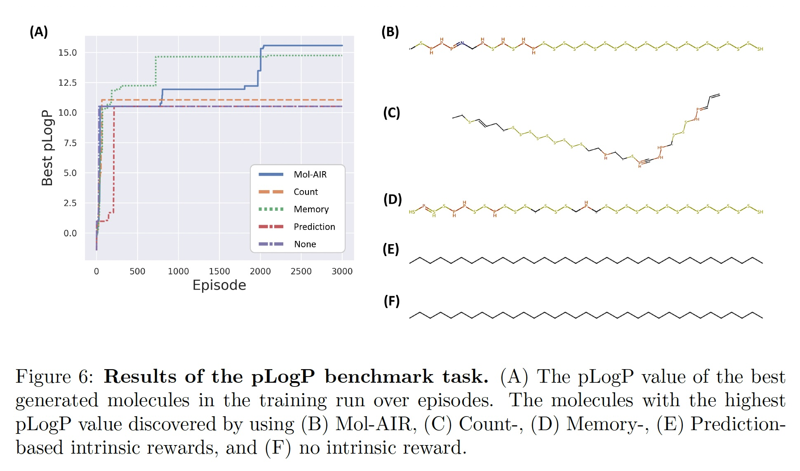

# Mol-AIR

This repository is the implementation of our paper (not published yet): 

Mol-AIR: Molecular Reinforcement Learning with Adaptive Intrinsic Reward for Goal-directed Molecular Generation

We optimized the pLogP score and could find sulfur-phosphorus-nitrogen chain using Mol-AIR:



For other properties, we outperformed the previous methods. Please refer to our paper for more details.

## Setup

Our environment settings:

* OS: Ubuntu 20.04.6 LTS
* GPU: NVIDIA RTX A6000
* Python: 3.7 (ours: 3.7.16)

> Note: If you don't use Python 3.7, you may have dependency issues.

Packages:

* [PyTorch](https://pytorch.org/get-started/previous-versions/#linux-and-windows-21): 1.11.0+cu113
* [TensorBoard](https://pypi.org/project/tensorboard/2.11.2/): 2.11.2
* [PyYAML](https://pypi.org/project/PyYAML/6.0/): 6.0
* [SELFIES](https://pypi.org/project/selfies/0.2.4/): 0.2.4
* [RDKit](https://pypi.org/project/rdkit/2022.9.5/): 2022.9.5
* [PyTDC](https://pypi.org/project/PyTDC/0.4.0/): 0.4.0
* [NetworkX](https://pypi.org/project/networkx/2.6.3/): 2.6.3
* [Pandas](https://pypi.org/project/pandas/1.3.5/): 1.3.5

Activate Python 3.7 environment (e.g., conda) and install the required packages (only linux):

```bash
sh setup.sh
```

> Note: If your OS is not linux, install the packages manually using pip.

## Run

All experimental configurations are in the [config](config/) directory. `ppo.yaml` is the configuration for PPO, `hir.yaml` is for HIR (Count-based intrinsic reward used), and `lir.yaml` is for LIR (RND intrinsic reward used) and `molair.yaml` is for Mol-AIR (Both Count-based and RND intrinsic rewards used). For all molecular properties, we used the same configuration except for the intrinsic reward coefficients. 

You can run our experiments by entering the below command:

```bash
python run.py [CONFIG_PATH]
```

For example, you can run Mol-AIR ($\alpha$ differs for each property, $\beta = 0.01$):

```bash
python run.py config/plogp/molair.yaml # pLogP
python run.py config/qed/molair.yaml # QED
python run.py config/similarity/molair.yaml # Similarity
python run.py config/gsk3b/molair.yaml # GSK3B
python run.py config/jnk3/molair.yaml # JNK3
python run.py config/gsk3b_jnk3/molair.yaml # GSK3B+JNK3
```

Experiment results are saved in the `results` directory. For example, if you run the pLogP with Mol-AIR, the result is saved in `results/PLogP-MolAIR`. 

There are two methods to view the results: TensorBoard and CSV. You can see the simple results such as cumulative reward, training loss, etc by Tensorboard. To do so, enter the command: 

```bash
tensorboard --logdir=[EXPERIMENT_RESULT_DIR]
```

`[EXPERIMENT_RESULT_DIR]` is the directory where the experiment result is saved. For example, `results/PLogP-MolAIR`.

If you want to see the detailed results of the molecules generated, you should see the CSV file `[EXPERIMENT_RESULT_DIR]/episode_metric.csv`. Using the CSV files, you can compare the results of different methods by executing the `export.py`:

```
usage: export.py [-h] [-e EPISODE] [-m MOVING_AVERAGE]
                 TITLE EXPERIMENT_RESULT_DIR [EXPERIMENT_RESULT_DIR ...]

positional arguments:
  TITLE                 Title for the data
  EXPERIMENT_RESULT_DIR
                        Directories of experiment results

optional arguments:
  -h, --help            show this help message and exit
  -e EPISODE, --episode EPISODE
                        Episode number (default = max)
  -m MOVING_AVERAGE, --moving_average MOVING_AVERAGE
                        Moving average n (default = max_episode / 100)
```

For example, if you want to compare the results of PPO, HIR, LIR and Mol-AIR for pLogP (until 3000 episodes), enter the command like this: `$ python export.py -e 3000 pLogP results/PLogP-PPO results/PLogP-HIR results/PLogP-LIR results/PLogP-MolAIR`. Then, the comparison results are saved in the `exports/[TITLE]` directory. In this case, the directory is `exports/pLogP`.

## Configuration

If you want to customize the experiment configuration, you should modify the configuration file or create a new one. The configuration file is written in YAML format. The configuration file starts with experiment ID and contains four sections: `Agent`, `Env`, `Train`, and `CountIntReward`. For example, the pLogP with Mol-AIR configuration is as follows:

```yaml
PLogP-MolAIR:
  Agent:
    type: RND
    n_steps: 64
    epoch: 6
    seq_len: 35
    seq_mini_batch_size: 16
    gamma: 1.0
    nonepi_adv_coef: 1.0
  Env:
    plogp_coef: 1.0
  Train:
    num_envs: 64
    seed: 0
    total_time_steps: 120000
    summary_freq: 1000
    device: cuda
  CountIntReward:
    crwd_coef: 0.01
```

In this case, `PLogP-MolAIR` is the experiment ID. 

The most important variables are `Agent/nonepi_adv_coef` and `CountIntReward/crwd_coef`. The `nonepi_adv_coef` is equal to $\alpha$ and the `crwd_coef` is equal to $\alpha\beta$ in the context of our paper. Since these variables determine the power of the intrinsic reward, it affects the performance of the agent.

The details of configuration variables are described below.

> Note: If the configuration variable has no default value, you must set the value explicitly in the configuration file.

### Agent

`Agent` section contains the settings for the RL agent. First of all, you should choose the agent type:

|Setting|Description|
|---|---|
|`type`|(`str`) Which agent to use. <br><br> Options: `PPO`, `RND`|


Since both PPO and RND use recurrent neural networks, you should consider sequence-based settings:

|Setting|Description|
|---|---|
|`n_steps`|(`int`) The number of time steps to collect experiences until training. The number of total experiences (`entire_batch_size`) is `num_envs * n_steps`. Since PPO is on-policy method, the experiences are discarded after training.|
|`epoch`|(`int`) The number of times that the entire experience batch is used to update parameters.|
|`seq_len`|(`int`) The sequence length of the experience sequence batch when **training**. The entire experience batch is truncated by `seq_len` unit then results in the experience sequences with `padding_value`. This is why the entire sequence batch size (`entire_seq_batch_size`) is greater than `entire_batch_size`. Typically `8` or greater value are recommended.|
|`seq_mini_batch_size`|(`int`) The sequence mini-batches are selected randomly and independently from the entire experience sequence batch during one epoch. The number of parameters updates at each epoch is the integer value of `entire_seq_batch_size / seq_mini_batch_size`.|
|`padding_value`|(`float`, default = `0.0`) Pad sequences to the value for the same `seq_len`.|

RND is based on PPO, so it has some same settings with PPO. The common PPO settings are:

|Setting|Description|
|---|---|
|`gamma`|(`float`, default = `0.99`) Discount factor $\gamma$ of future episodic rewards.|
|`lam`|(`float`, default = `0.95`) Regularization parameter $\lambda$ which controls the bias-variance trade-off of Generalized Advantage Estimation (GAE).|
|`epsilon_clip`|(`float`, default = `0.2`) Clamps the probability ratio ($\frac{\pi_{\text{new}}}{\pi_{\text{old}}}$) into the range $[1-\epsilon, 1+\epsilon]$.|
|`critic_loss_coef`|(`float`, default = `0.5`) State value loss (critic loss) multiplier.|
|`entropy_coef`|(`float`, default = `0.001`) Entropy multiplier used to compute loss. It adjusts exploration-exploitation trade-off.|

RND has some unique settings (**RND only**):

|Setting|Description|
|---|---|
|`gamma_n`|(`float`, default = `0.99`) Discount factor $\gamma_N$ of future non-episodic rewards.|
|`nonepi_adv_coef`|(`float`, default = `1.0`) Non-episodic advantage multiplier. It is equal to $\alpha$ in the context of our paper.|
|`rnd_pred_exp_proportion`|(`float`, default = `0.25`) The proportion of experiences used to train RND predictor to keep the effective batch size.|
|`init_norm_steps`|(`int \| None`, default = `50`) The initial time steps to initialize normalization parameters of both observation and hidden state. If the value is `None`, the algorithm never normalize them during training.|
|`obs_norm_clip_range`|(`[float, float]`, default = `[-5.0, 5.0]`) Clamps the normalized observation into the range `[min, max]`.|
|`hidden_state_norm_clip_range`|(`[float, float]`, default = `[-5.0, 5.0]`) Clamps the normalized hidden state into the range `[min, max]`.|

### Env

`Env` section contains the settings for the chemical environment which evaluates the generated molecules. You should set the property score coefficients. If you don't set the value, the property is never evaluated.

|Setting|Description|
|---|---|
|`plogp_coef`|(`float`, default = `0.0`) pLogP score coefficient.|
|`qed_coef`|(`float`, default = `0.0`) QED score coefficient.|
|`similarity_coef`|(`float`, default = `0.0`) Similarity score coefficient.|
|`gsk3b_coef`|(`float`, default = `0.0`) GSK3B score coefficient.|
|`jnk3_coef`|(`float`, default = `0.0`) JNK3 score coefficient.|
|`max_str_len`|(`int`, default = `35`) Maximum length of SELFIES strings.|

We highly recommend to set the coefficient value to `1.0` for the property you want to optimize. For example, if you want to optimize the pLogP score, set `plogp_coef` to `1.0` and the other coefficients to `0.0`. If you want to optimize multiple properties at the same time, we recommend that the weighted sum of the values is `1.0`.

### Train

`Train` section contains the settings for the training process.

|Setting|Description|
|---|---|
|`num_envs`|(`int`) The number of parallel environments.|
|`total_time_steps`|(`int`) The number of total time steps to train.|
|`summary_freq`|(`int \| None`, default = `None`) Summary frequency. Defaults to `time_steps` / `20`.|
|`agent_save_freq`|(`int \| None`, default = `None`) Agent save frequency. Defaults to `summary_freq` * `10`.|
|`seed`|(`int \| None`, default = `None`) Random seed.|
|`device`|(`str \| None`, default = `None`) Device on which the agent works. If this setting is `None`, the agent device is same as your network's one. Otherwise, the network device changes to this device. <br><br> Options: `None`, `cpu`, `cuda`, `cuda:0` and other devices of `torch.device()` argument|


### CountIntReward

`CountIntReward` section contains the settings for the count-based intrinsic reward. If you exclude this section, the count-based intrinsic reward is not used.

|Setting|Description|
|---|---|
|`crwd_coef`|(`float`, default = `0.0`) Count-based intrinsic reward coefficient. It is equal to $\alpha\beta$ in the context of our paper.|
|`max_mol_count`|(`int`, default = `10`) Maximum count $\tau$ of the same molecule. The count start from 0.|
|`fingerprint_bits`|(`int`, default = `256`)|
|`fingerprint_radius`|(`int`, default = `2`)|
|`lsh_bits`|(`int`, default = `32`)|

## References for Source Codes and Data

[1] [aspuru-guzik-group/curiosity (Github)](https://github.com/aspuru-guzik-group/curiosity)  
[2] [kengz/SLM-Lab (Github)](https://github.com/kengz/SLM-Lab)  
[3] [jcwleo/random-network-distillation-pytorch (Github)](https://github.com/jcwleo/random-network-distillation-pytorch)  
[4] [openai/gym (Github)](https://github.com/openai/gym)  